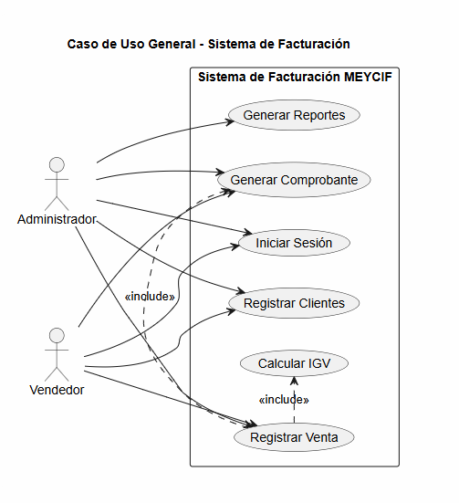

# REPORTE DE AVANCE DE PROYECTO - SPRINT 1

---

## CARATULA DEL ENTREGABLE

| INFORMACION ACADÉMICA Y DEL PROYECTO | DETALLES ESPECIFICOS |
| :--- | :--- |
| **Universidad** | Universidad Peruana Los Andes (UPLA) |
| **Facultad / Escuela** | Facultad de Ingeniería / Escuela Profesional de Ingeniería de Sistemas |
| **Ciclo Académico** | VI Ciclo |
| **Curso** | Construcción de Software |
| **Proyecto de Desarrollo** | Sistema de Gestión de Facturación para la Empresa de Calzados Meycif |
| **Empresa Beneficiaria** | Empresa de Calzados Meycif |
| **Presentado por** | Hinostroza Canchumanya Luis Daniel (R01070F) Enciso Carbajal Jhon Ever (R01057C) Aldair Ulises Sanchez Romero (R01133A) |
| **Asesor** | Gordillo Flores Rafael |
| **Sede / Ciudad** | Huancayo - Perú |
| **Año** | 2026 |

---

## 1. INTRODUCCION

### 1.1 Alcance
Este documento especifica los requisitos funcionales y no funcionales para el desarrollo del Sistema de Gestión de Facturación e Inventario para la Empresa de Calzados Meycif. El sistema abarca el control automatizado de stock, la gestión de ventas, emisión de comprobantes de pago y la seguridad en el acceso de usuarios de acuerdo a sus roles operativos dentro de la organización.

### 1.2 Personal Involucrado
El desarrollo del proyecto está a cargo del equipo de estudiantes de Ingeniería de Sistemas de la UPLA, desempeñando roles dentro del marco de trabajo Scrum (Frontend, Backend, Core Integrator), bajo la supervisión académica del asesor del curso.

### 1.3 Definiciones, siglas y abreviaturas
* **RF:** Requisito Funcional.
* **RNF:** Requisito No Funcional.
* **CU:** Caso de Uso.
* **BD:** Base de Datos.
* **Meycif:** Empresa comercializadora de calzado objeto del presente software.

---

## 2. DESCRIPCION GENERAL

### 2.1 Perspectiva del producto
El software se concibe como una aplicación web centralizada que interactúa de manera directa con un servidor backend y un motor de base de datos relacional. Permitirá sustituir los registros manuales por interfaces digitales integradas.

### 2.2 Funcionalidad del producto
Las principales funcionalidades incluyen la autenticación de personal, la administración detallada del catálogo de calzados (tallas, modelos, marcas), el control de existencias, la automatización del proceso de facturación y ventas directas en caja, y la consolidación de reportes administrativos.

---

## 3. DIAGRAMA DE CASOS DE USOS DEL SISTEMA

A continuación, se integra el modelado visual de los Casos de Uso desarrollados para el sistema, el cual define el alcance de las interacciones entre los usuarios operativos y la lógica del negocio:

### Descripcion de los Actores y Limites del Sistema
* **Administrador / Operador de Tienda:** Personal de la empresa Meycif encargado de interactuar con el sistema para realizar tareas diarias como la consulta de stock de zapatillas, el registro de ventas y la emisión de comprobantes de pago.
* **Sistema (Servicios Backend):** Componente de software encargado de procesar las solicitudes de las interfaces, realizar las validaciones de seguridad pertinentes en la base de datos y mantener la persistencia de la información.
* **Limite del Sistema:** Define el alcance del software de facturación e inventario, delimitando qué acciones requieren conexión obligatoria con los servicios del servidor.

---

## 4. CATALOGO DE REQUISITOS DEL SISTEMA A DESARROLLAR

### 4.1 Requisitos Generales del Sistema
* **Interfaces de usuario:** Diseño adaptativo enfocado en pantallas de escritorio para uso en puntos de venta.
* **Interfaces de hardware:** Operación estándar sobre computadoras personales con periféricos básicos y lector de códigos de barras.
* **Interfaces de comunicacion:** Transferencia segura de datos mediante el protocolo HTTP de manera local o en la nube.

### 4.2 Requisitos Funcionales del Sistema

#### RF-01: Gestion de Usuarios y Autenticacion
| Atributo | Detalle |
| :--- | :--- |
| **Descripcion** | El sistema debe permitir a los empleados iniciar sesion mediante un formulario que valide sus credenciales para restringir las funciones del software segun el rol asignado. |
| **Actores** | Administrador, Vendedor, Operador |
| **Prioridad** | Alta |
| **Criterios de Aceptacion / Reglas de Negocio** | 1. El usuario debe ingresar obligatoriamente un nombre de usuario y contraseña correctos. 2. Al fallar en la validacion, el sistema bloqueara el ingreso mostrando una alerta de seguridad genérica: "Usuario o contraseña incorrectos". 3. Al autenticarse con éxito, se generara un token de sesion que almacenara los permisos del rol en el navegador. |

#### RF-02: Registro y Mantenimiento de Productos (Inventario)
| Atributo | Detalle |
| :--- | :--- |
| **Descripcion** | El sistema debe permitir registrar, modificar, inactivar y consultar el catalogo de productos de la zapatería, incluyendo codigo, marca, modelo, talla, stock mínimo y precio de venta. |
| **Actores** | Administrador, Operador |
| **Prioridad** | Alta |
| **Criterios de Aceptacion / Reglas de Negocio** | 1. No se permitira el registro de dos productos con el mismo codigo de barras o codigo interno. 2. El campo "Talla" debe aceptar valores numéricos validos para calzado. 3. El sistema debe emitir una alerta visual cuando el stock actual sea igual o menor al stock mínimo configurado. |

#### RF-03: Control de Stock y Reabastecimiento
| Atributo | Detalle |
| :--- | :--- |
| **Descripcion** | El sistema debe actualizar de manera automatica el inventario cada vez que se realice una venta o se registre un ingreso de mercadería por parte de los proveedores. |
| **Actores** | Administrador, Operador |
| **Prioridad** | Alta |
| **Criterios de Aceptacion / Reglas de Negocio** | 1. Toda entrada de mercadería debe quedar vinculada a un documento de sustento (Guía de remision o factura del proveedor). 2. El sistema no permitira el egreso de inventario si la cantidad solicitada supera al stock físico disponible, emitiendo un mensaje de error. |

#### RF-04: Gestion de Ventas y Facturacion Directa
| Atributo | Detalle |
| :--- | :--- |
| **Descripcion** | El sistema debe permitir procesar las ventas en caja, seleccionando los calzados mediante el buscador o lector de barras, calculando subtotales, impuestos (IGV) y el monto total de la operacion. |
| **Actores** | Vendedor, Administrador |
| **Prioridad** | Alta |
| **Criterios de Aceptacion / Reglas de Negocio** | 1. El sistema calculara de forma automatica el IGV (18%) sobre el valor de venta del producto. 2. Se bloqueara la confirmacion de la venta si el cliente no define el metodo de pago (Efectivo, Tarjeta o Transferencia). |

#### RF-05: Emision de Comprobantes de Pago
| Atributo | Detalle |
| :--- | :--- |
| **Descripcion** | Al finalizar una venta, el sistema debe generar e imprimir boletas o facturas electrónicas en formato estándar para ticketera, registrando la serie y correlativo correspondiente. |
| **Actores** | Vendedor, Administrador |
| **Prioridad** | Alta |
| **Criterios de Aceptacion / Reglas de Negocio** | 1. Para la emision de facturas, el sistema obligara al ingreso de un RUC valido de 11 dígitos previamente consultado o registrado. 2. Cada comprobante debe guardar una correlatividad estricta por serie, impidiendo duplicados en el sistema. |

#### RF-06: Consulta de Clientes y Proveedores
| Atributo | Detalle |
| :--- | :--- |
| **Descripcion** | El sistema debe proveer un modulo para la busqueda y registro rápido de los datos de los clientes (DNI/RUC, nombre, telefono) y proveedores durante el flujo de venta o abastecimiento. |
| **Actores** | Vendedor, Operador, Administrador |
| **Prioridad** | Media |
| **Criterios de Aceptacion / Reglas de Negocio** | 1. El ingreso de DNI debe contener exactamente 8 caracteres numéricos y el RUC debe contener exactamente 11 caracteres numéricos. 2. Al digitar el identificador del cliente registrado, el sistema autocompletara los datos de facturacion en la pantalla de ventas de forma instantánea. |

#### RF-07: Apertura y Cierre de Caja (Arqueo)
| Atributo | Detalle |
| :--- | :--- |
| **Descripcion** | El sistema debe permitir a los vendedores abrir el turno de caja registrando un saldo inicial de dinero en efectivo y realizar el arqueo al cierre de la jornada laboral. |
| **Actores** | Vendedor, Administrador |
| **Prioridad** | Media |
| **Criterios de Aceptacion / Reglas de Negocio** | 1. No se podran registrar ventas en el sistema si la caja no ha sido previamente abierta para el turno actual. 2. El reporte de cierre detallara el monto estimado calculado por el software frente al monto físico real ingresado por el cajero, registrando las diferencias si existieran. |

#### RF-08: Generacion de Reportes de Gestion Comercial
| Atributo | Detalle |
| :--- | :--- |
| **Descripcion** | El sistema debe permitir consolidar los datos de las transacciones registradas para generar reportes cuantitativos (ingresos económicos y estadísticas de los productos más vendidos) estructurados por periodos diarios, semanales y mensuales. |
| **Actores** | Administrador |
| **Prioridad** | Media |
| **Criterios de Aceptacion / Reglas de Negocio** | 1. El sistema debe bloquear de forma estricta el acceso al modulo de reportes si el usuario autenticado tiene el rol de "Vendedor". 2. Los datos de ingresos económicos y volumen de ventas generados en los reportes deben coincidir de forma exacta con la sumatoria aritmética de las boletas y facturas internas registradas en el rango de fechas consultado. |

---

## 5. REQUISITOS NO FUNCIONALES DEL SISTEMA (RNF)

* **RNF-01 Seguridad:** Los datos de las contraseñas de los usuarios deben guardarse mediante algoritmos de cifrado unidireccional en el backend.
* **RNF-02 Disponibilidad:** El sistema web debe garantizar un correcto despliegue local durante el horario comercial de la tienda de calzados.
* **RNF-03 Usabilidad:** Las interfaces de facturacion deben completarse con el menor numero de clics posibles para agilizar la atencion en el punto de venta.
