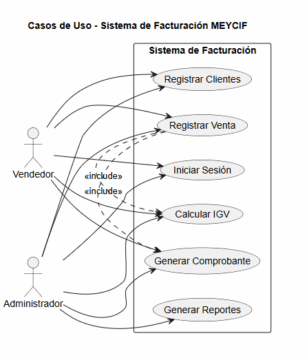

# Sistema de Gestión de Facturación e Inventario para Calzados Meycif

## Descripción del proyecto

El presente proyecto consiste en el desarrollo de un Sistema de Gestión de Facturación e Inventario para la Empresa de Calzados Meycif. El sistema permite administrar productos, controlar el stock, registrar clientes, gestionar ventas, emitir comprobantes y generar reportes para mejorar el control administrativo de la empresa.

# SGF-Meycif: Sistema de Gestión y Facturación Electrónica

## Sprint 0 Goal
"Al finalizar el Sprint 0, el equipo cuenta con una arquitectura de proyecto validada y un entorno de desarrollo estandarizado para **SGF-Meycif**. Hemos consolidado la documentación técnica (SRS bajo IEEE 830) y la gobernanza del código (Git Flow), dejando la infraestructura totalmente operativa para iniciar el desarrollo de las historias de usuario transaccionales en el Sprint 1."

## Equipo de trabajo
| Rol | Integrante | GitHub |
|---|---|---|
| Product Owner | Aldair Sánchez | R01133A@upla.edu.pe |
| Scrum Master | Daniel Hinostroza | R01070F@upla.edu.pe |
| Backend Dev | Jhon Carbajal | R01057C@upla.edu.pe |

## Stack Tecnológico
- **Lenguaje:** Python 3.12+
- **Framework:** Django 5.x
- **Base de Datos:** SQL Server / Supabase
- **Frontend:** Bootstrap 5, HTML5, CSS3
- **Metodología:** Scrum (Sprint 0 a Sprint 4)
- **Control de Versiones:** Git y GitHub con metodología Git Flow

## Módulos principales (Product Backlog)
- EP-01 Seguridad: Login, roles y auditoría.
- EP-02 Ventas: Búsqueda, registro y descuentos.
- EP-03 Inventario: Gestión de stock y transferencias.
- EP-04 Facturación: Integración SUNAT y reportes.
## Estructura del proyecto

```txt
sgfi-calzados-meycif/
├── public/
│   ├── index.html
│   ├── app.js
│   ├── styles.css
│   └── modules/
│       ├── auth.js
│       ├── billing.js
│       ├── customers.js
│       ├── dashboard.js
│       ├── products.js
│       ├── reports.js
│       ├── sales.js
│       ├── stock.js
│       ├── suppliers.js
│       └── users.js
├── database.js
├── database.json
├── package.json
├── package-lock.json
└── server.js


